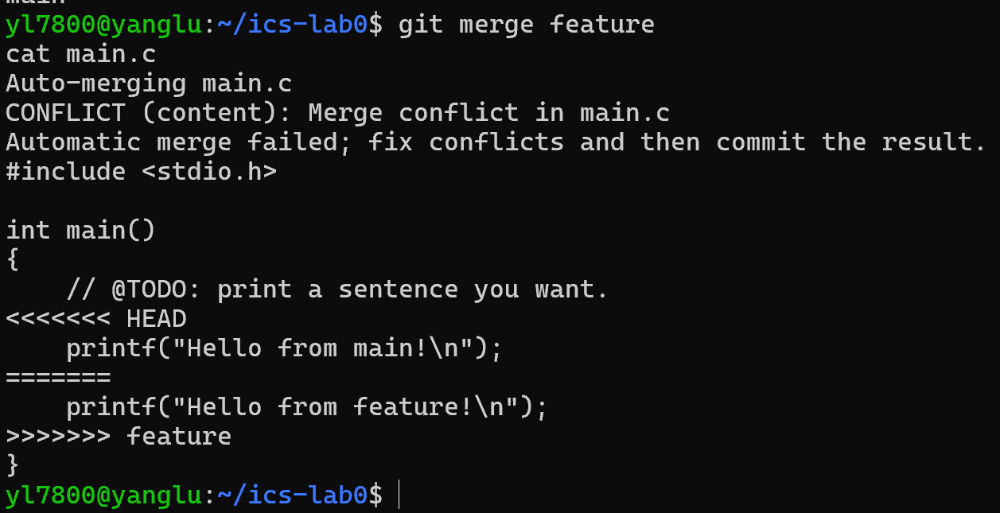
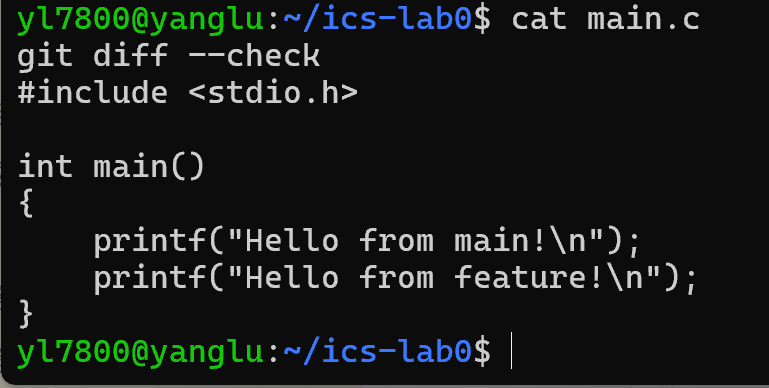

# Lab 0：GitLab 实验报告

## 一、文档问题

### 1. 多人协同开发经历

此前我主要独立完成编程练习，还没有参与过多人共同维护同一代码仓库的正式项目。通过本实验，我理解了可以用不同分支分别开发，再通过合并汇总修改；如果多人修改了同一处内容，就需要检查并解决冲突。

### 2. 为什么 Git 要分“暂存”和“提交”两步？

暂存区让我在提交前选择这次要记录哪些文件和修改。例如，修改代码时产生的临时文件不应一起提交。我可以先用 `git add` 选择需要的内容，检查无误后再用 `git commit` 保存一个有明确目的的版本。这有助于让提交历史更清晰。

### 3. `git branch` 和 `git branch -a` 的区别

`git branch` 列出本地分支；`git branch -a` 除本地分支外，还列出本地已知的远程跟踪分支，例如 `remotes/origin/main`。远程仓库有新分支时，通常需要先获取远程信息，本地列表才会更新。

## 二、阅读与思考

### 阅读一：[Commit message 和 Change log 编写指南](https://www.ruanyifeng.com/blog/2016/01/commit_message_change_log.html)

文章说明，提交说明应清楚表达本次修改的目的。规范的提交说明方便浏览历史、筛选特定类型的修改，也能帮助生成更新日志。文章介绍了由类型、范围和简短描述组成的提交说明格式。

### 阅读二：[语义化版本 2.0.0](https://semver.org/lang/zh-CN/)

文章介绍 `主版本号.次版本号.修订号` 的版本格式：不兼容的接口修改增加主版本号；向下兼容的新功能增加次版本号；向下兼容的问题修复增加修订号。这样的约定使版本号能够传达变更对使用者的影响。

### 为什么要学习 Git

Git 能记录修改历史，让我知道每次改了什么，并在需要时回到以前的版本。分支允许不同工作分别进行，合并功能帮助整理这些修改。配合 GitHub，还能把本地提交上传保存并与他人协作。本实验让我特别注意到：`git commit` 保存的是本地版本，`git push` 才会把提交上传到远程仓库。

## 三、实验过程

1. 使用课程提供的模板创建个人仓库，并通过 HTTPS 克隆到 WSL 中。
2. 将 `main.c` 中打印的句子改为 `Hello, ics!`，在 `main` 分支完成第一次提交。
3. 创建 `feature` 分支，把同一行改为 `Hello from feature!` 并提交。
4. 切回 `main`，把该行改为 `Hello from main!` 并提交。
5. 在 `main` 执行 `git merge feature`。因为两个分支修改了同一行，Git 报告 `main.c` 存在内容冲突。

6. 编辑 `main.c`，删除冲突标记，保留两个分支的打印语句。检查文件后完成合并提交。

7. 将本地 `main` 分支推送到[个人 GitHub 仓库](https://github.com/Noelle1106/ics-lab0)。

## 四、实验总结

我完成了克隆仓库、修改文件、暂存、提交、创建分支、合并、解决冲突和推送的基本流程。合并冲突并不代表文件损坏，而是 Git 无法替我决定同一处修改该保留哪个版本；需要我检查冲突标记、整理出最终内容，再提交解决结果。
